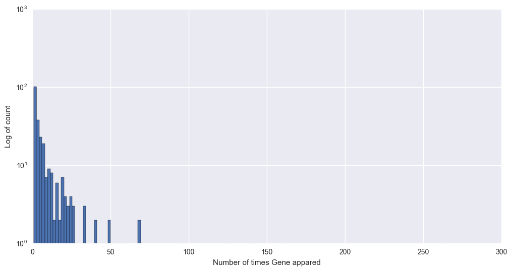

```python
# Text analysis helper libraries
from gensim.summarization import summarize
from gensim.summarization import keywords

# Text analysis helper libraries for word frequency etc..
from nltk.tokenize import word_tokenize
from nltk.stem import WordNetLemmatizer
from nltk.corpus import stopwords
from string import punctuation

# Word cloud visualization libraries
from scipy.misc import imresize
from PIL import Image
#from wordcloud import WordCloud, ImageColorGenerator
from collections import Counter

# Word2Vec related libraries
from gensim.models import KeyedVectors

#NLP

#Importing dataset
import pandas as pd 
import numpy as np
import matplotlib.pyplot as plt
import seaborn as sns

import re
import nltk
from nltk.corpus import stopwords
from nltk.stem.porter import PorterStemmer
#Importing Dataset
#import os
#os.chdir('D:\Py-R\cancer')
import os
os.chdir('C:\\Users\\Jameel shaik\\Documents\\Projects\\Personalized Medicine Redefining Cancer Treatment')
source= 'C:\\Users\\Jameel shaik\\Documents\\Projects\\Personalized Medicine Redefining Cancer Treatment'

train_variant = pd.read_csv(source+'/training_variants')
test_variant = pd.read_csv(source+'/test_variants')

train_text = pd.read_csv(source+'/training_text',sep = '\|\|', engine= 'python', header=None, 
                     skiprows=1, names=["ID","Text"])
test_text = pd.read_csv(source+'/test_text',sep = '\|\|', engine= 'python', header=None, 
                     skiprows=1, names=["ID","Text"])

train = pd.merge(train_variant, train_text, how = 'left', on = 'ID').fillna('')
test = pd.merge(test_variant, test_text, how = 'left', on = 'ID').fillna('')


#Data Exploration
train.Gene.nunique()
train['Gene'].unique()

k = train.groupby('Gene')['Gene'].count()

plt.figure(figsize=(12,6))
plt.hist(k, bins=150,log=True)
plt.xlabel('Number of times Gene appared')
plt.ylabel('Log of count')
plt.show()

#count Gene
from collections import Counter
plt.figure(figsize=(12,10))
sns.countplot((train['Gene']))
plt.xticks()
genecount = Counter(train['Gene'])
print(genecount,'\n',len(genecount))

#train.Variation.nunique()
#train['Variation'].unique()
#k = train.groupby('Variation')['Variation'].count()

plt.figure(figsize=(12,6))
```





    Counter({'BRCA1': 264, 'TP53': 163, 'EGFR': 141, 'PTEN': 126, 'BRCA2': 125, 'KIT': 99, 'BRAF': 93, 'ALK': 69, 'ERBB2': 69, 'PDGFRA': 60, 'PIK3CA': 56, 'CDKN2A': 52, 'FGFR2': 50, 'FLT3': 49, 'TSC2': 47, 'MTOR': 45, 'KRAS': 44, 'MAP2K1': 43, 'VHL': 41, 'RET': 40, 'FGFR3': 39, 'MLH1': 35, 'JAK2': 33, 'MET': 33, 'SMAD4': 33, 'NOTCH1': 31, 'AKT1': 28, 'ROS1': 26, 'ABL1': 26, 'PTPN11': 26, 'CBL': 25, 'CTNNB1': 25, 'PIK3R1': 24, 'RUNX1': 24, 'SMAD3': 23, 'PTPRT': 23, 'PDGFRB': 23, 'HRAS': 22, 'NFE2L2': 22, 'MSH2': 21, 'SMO': 21, 'TSC1': 20, 'AR': 20, 'SPOP': 20, 'ERBB4': 20, 'FBXW7': 19, 'SMAD2': 19, 'ERCC2': 19, 'JAK1': 18, 'RHOA': 17, 'NTRK1': 16, 'NF1': 16, 'IDH1': 16, 'SF3B1': 16, 'ESR1': 16, 'PMS2': 16, 'KEAP1': 14, 'TET2': 14, 'FGFR1': 13, 'MSH6': 13, 'STK11': 13, 'CCND1': 13, 'RAF1': 12, 'CARD11': 12, 'PPP2R1A': 12, 'NRAS': 12, 'EWSR1': 11, 'MAP2K2': 11, 'NF2': 11, 'AKT2': 11, 'ERBB3': 11, 'PIK3CB': 10, 'RB1': 10, 'CDK12': 10, 'POLE': 10, 'EP300': 9, 'CDH1': 9, 'BAP1': 9, 'MAP2K4': 9, 'DICER1': 9, 'FANCA': 9, 'DDR2': 9, 'STAT3': 8, 'FOXA1': 8, 'EPAS1': 8, 'EZH2': 8, 'PIK3R2': 8, 'TERT': 8, 'PIM1': 8, 'ETV6': 8, 'TGFBR1': 8, 'MYC': 8, 'KDR': 7, 'SOX9': 7, 'ARAF': 7, 'CREBBP': 7, 'RAC1': 7, 'CDKN2B': 7, 'BRIP1': 7, 'CHEK2': 7, 'CCND3': 7, 'ERCC4': 6, 'TMPRSS2': 6, 'CASP8': 6, 'B2M': 6, 'NKX2-1': 6, 'ELF3': 6, 'SMARCA4': 6, 'SOS1': 6, 'MEF2B': 6, 'ATM': 6, 'GNAS': 5, 'NTRK3': 5, 'CIC': 5, 'AGO2': 5, 'PRDM1': 5, 'APC': 5, 'IDH2': 5, 'BCOR': 5, 'KDM5C': 5, 'CTCF': 5, 'PTPRD': 5, 'MED12': 5, 'TGFBR2': 5, 'AKT3': 4, 'CDKN1B': 4, 'RIT1': 4, 'YAP1': 4, 'FAT1': 4, 'MPL': 4, 'KMT2C': 4, 'ERG': 4, 'MAP3K1': 4, 'RASA1': 4, 'KNSTRN': 4, 'PPP6C': 4, 'NFKBIA': 4, 'SETD2': 3, 'IGF1R': 3, 'RAD50': 3, 'CDKN1A': 3, 'RBM10': 3, 'BTK': 3, 'PIK3CD': 3, 'MYD88': 3, 'TET1': 3, 'ACVR1': 3, 'DNMT3A': 3, 'GATA3': 3, 'CARM1': 3, 'RHEB': 3, 'NTRK2': 3, 'FGFR4': 3, 'PBRM1': 3, 'HNF1A': 3, 'H3F3A': 3, 'AURKA': 3, 'ETV1': 3, 'KMT2A': 3, 'NUP93': 3, 'U2AF1': 3, 'CDK4': 3, 'NOTCH2': 2, 'TP53BP1': 2, 'FOXL2': 2, 'ERCC3': 2, 'PTCH1': 2, 'NSD1': 2, 'XPO1': 2, 'BCL2L11': 2, 'NPM1': 2, 'MAPK1': 2, 'BCL10': 2, 'ARID2': 2, 'SRC': 2, 'RAD21': 2, 'FOXP1': 2, 'XRCC2': 2, 'ARID1B': 2, 'ATRX': 2, 'RXRA': 2, 'BRD4': 2, 'CDK6': 2, 'MGA': 2, 'DNMT3B': 2, 'RAB35': 2, 'KMT2D': 2, 'KDM6A': 2, 'CCNE1': 2, 'SMARCB1': 2, 'RAD51C': 2, 'HLA-A': 2, 'MYCN': 2, 'SRSF2': 1, 'PAK1': 1, 'EIF1AX': 1, 'AXL': 1, 'LATS1': 1, 'ASXL2': 1, 'RAD51B': 1, 'WHSC1L1': 1, 'PAX8': 1, 'MDM4': 1, 'VEGFA': 1, 'ARID1A': 1, 'FGF4': 1, 'KMT2B': 1, 'FANCC': 1, 'CCND2': 1, 'FGF19': 1, 'EPCAM': 1, 'HLA-B': 1, 'SHOC2': 1, 'RYBP': 1, 'WHSC1': 1, 'ERRFI1': 1, 'BCL2': 1, 'TCF7L2': 1, 'ARID5B': 1, 'SHQ1': 1, 'ASXL1': 1, 'FAM58A': 1, 'MEN1': 1, 'BARD1': 1, 'NCOR1': 1, 'RAD54L': 1, 'PIK3R3': 1, 'KDM5A': 1, 'FUBP1': 1, 'JUN': 1, 'RICTOR': 1, 'LATS2': 1, 'AURKB': 1, 'FGF3': 1, 'CEBPA': 1, 'ATR': 1, 'INPP4B': 1, 'FOXO1': 1, 'RNF43': 1, 'STAG2': 1, 'PMS1': 1, 'RARA': 1, 'PPM1D': 1, 'DUSP4': 1, 'SDHB': 1, 'GNA11': 1, 'GNAQ': 1, 'KLF4': 1, 'IL7R': 1, 'TCF3': 1, 'MDM2': 1, 'FLT1': 1, 'IKZF1': 1, 'GLI1': 1, 'RRAS2': 1, 'CDKN2C': 1, 'RAD51D': 1, 'MYOD1': 1, 'CTLA4': 1, 'IKBKE': 1, 'HIST1H1C': 1, 'SDHC': 1, 'CDK8': 1, 'AXIN1': 1}) 
     264


    <matplotlib.figure.Figure at 0xeee18d0>


```python
#cleaning of data
def cleantext(train):
    corpus = []
    for i in range(0,train.shape[0]):
        review = re.sub(r"[^A-Za-z0-9^,!.\/'+-=]"," ",train['Text'][i])
        review = review.lower().split()
        ps = PorterStemmer()
        review = [ps.stem(word) for word in review if not word in set(stopwords.words('english'))]
        review = ' '.join(review)
        corpus.append(review)
    
    return corpus

corp_train = cleantext(train)
corp_test = cleantext(test)

# Determine lenght of text
def textlen(train):
    k = train['Text'].apply(lambda x: len(str(x).split()))
    l = train['Text'].apply(lambda x: len(str(x)))
    return k, l

train['Text_no_word'], train['Text_no_char'] = textlen(train)
test['Text_no_word'], test['Text_no_char'] = textlen(test)

#
for i in range(10):
    print('\n Doc', str(i))
    stopcheck = Counter(corp_train[i].split())
    print(stopcheck.most_common()[:10])

from sklearn.feature_extraction.text import TfidfVectorizer
tfidf = TfidfVectorizer(
	min_df=1, max_features=1600, strip_accents='unicode',lowercase =True,
	analyzer='word', token_pattern=r'\w+', ngram_range=(1, 3), use_idf=True, 
	smooth_idf=True, sublinear_tf=True, stop_words = 'english'
).fit(train)

X_train = tfidf.transform(corp_train).toarray()
print(X_train)

X_test = tfidf.transform(corp_test).toarray()

# Feature Scaling
from sklearn.preprocessing import StandardScaler
sc = StandardScaler()
X_train = sc.fit_transform(X_train)
X_test = sc.transform(X_test)
y_train = train['Class']

#Converting to categorical variable
from sklearn.preprocessing import LabelEncoder, OneHotEncoder
le = LabelEncoder()
y_train=le.fit_transform(y_train)
#onh = OneHotEncoder(categorical_features = [0])
#y_train =onh.fit_transform(y_train).toarray()

# Preparing model
from sklearn.ensemble import RandomForestClassifier
classifier = RandomForestClassifier(n_estimators=5000,max_depth=8,min_samples_split=2)
classifier.fit(X_train,y_train)

#Predict
y_pred=classifier.predict_proba(X_test)
y=pd.DataFrame(y_pred)
#np.mean(y_pred==y_train)

submit = pd.DataFrame(test.ID)
submit = submit.join(pd.DataFrame(y_pred))
submit.columns = ['ID', 'class1','class2','class3','class4','class5','class6','class7','class8','class9']

submit.to_csv('submission.csv', index=False)
```

    
     Doc 0
    [('cyclin', 91), ('.', 81), ('cdk10', 65), ('fig.', 63), ('express', 59), ('cell', 58), ('protein', 50), ('ets2', 46), ('level', 41), (',', 39)]
    
     Doc 1
    [('c-cbl', 139), ('mutat', 103), ('.', 82), ('cell', 78), ('lung', 56), (',', 48), ('egfr', 38), ('1', 33), ('sampl', 33), ('met', 32)]
    
     Doc 2
    [('c-cbl', 139), ('mutat', 103), ('.', 82), ('cell', 78), ('lung', 56), (',', 48), ('egfr', 38), ('1', 33), ('sampl', 33), ('met', 32)]
    
     Doc 3
    [('cbl', 101), ('mutat', 94), ('case', 65), ('.', 41), ('upn', 38), ('cell', 37), ('aupd', 37), ('figur', 35), ('2', 30), ('analysi', 25)]
    
     Doc 4
    [('mutat', 150), ('cbl', 113), ('.', 95), ('cancer', 63), ('bind', 62), ('activ', 58), ('protein', 45), ('effect', 40), ('cell', 38), ('stabil', 35)]
    
     Doc 5
    [('mutat', 150), ('cbl', 113), ('.', 95), ('cancer', 63), ('bind', 62), ('activ', 58), ('protein', 45), ('effect', 40), ('cell', 38), ('stabil', 35)]
    
     Doc 6
    [('mutat', 150), ('cbl', 113), ('.', 95), ('cancer', 63), ('bind', 62), ('activ', 58), ('protein', 45), ('effect', 40), ('cell', 38), ('stabil', 35)]
    
     Doc 7
    [('cbl', 231), ('mutat', 201), ('cell', 172), ('flt3', 153), ('patient', 152), ('.', 147), (',', 85), ('mutant', 72), ('express', 60), ('exon', 57)]
    
     Doc 8
    [('cbl', 250), ('mutat', 185), ('.', 173), ('cell', 131), ('mutant', 96), ('activ', 93), ('phosphoryl', 82), ('express', 80), ('bind', 71), ('cancer', 63)]
    
     Doc 9
    [('cbl', 137), ('cell', 93), ('.', 78), ('express', 76), ('phosphoryl', 75), ('mutant', 63), ('gm-csfr', 58), ('gm-csf', 57), ('c', 52), ('enhanc', 50)]
    [[ 0.          0.97253148  0.23277141 ...,  0.          0.          0.        ]
     [ 0.27582062  0.96120913  0.         ...,  0.          0.          0.        ]
     [ 0.27582062  0.96120913  0.         ...,  0.          0.          0.        ]
     ..., 
     [ 0.          0.          0.         ...,  0.          0.          0.        ]
     [ 0.          0.          0.         ...,  0.          0.          0.        ]
     [ 0.          0.          0.         ...,  0.          0.          0.        ]]

